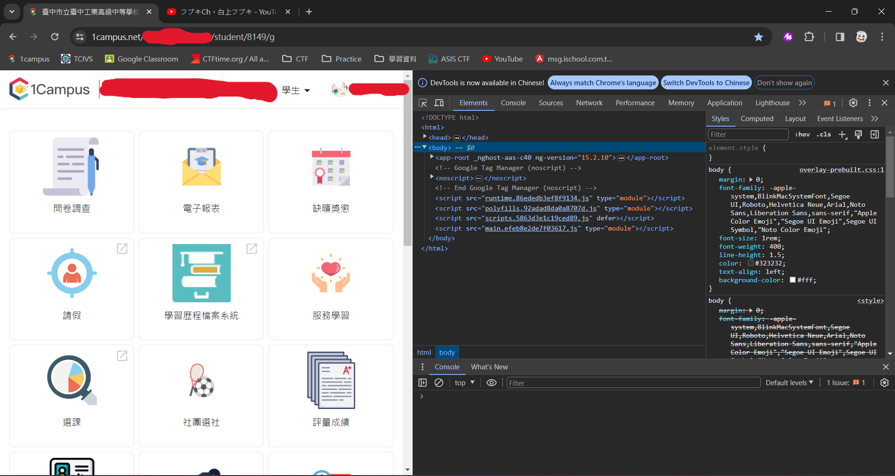
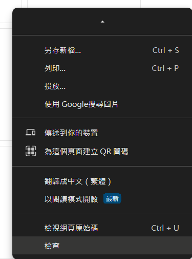
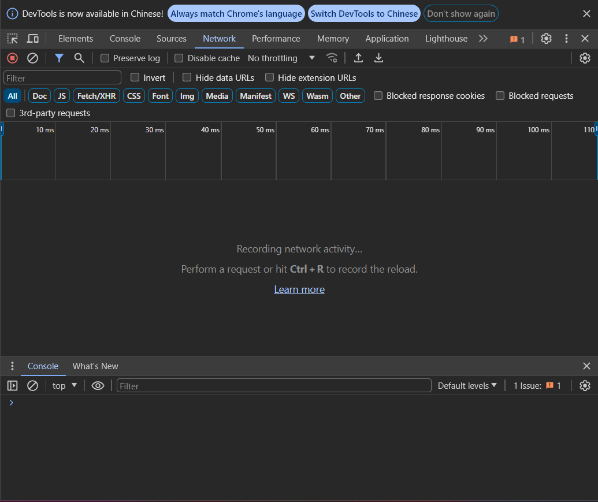
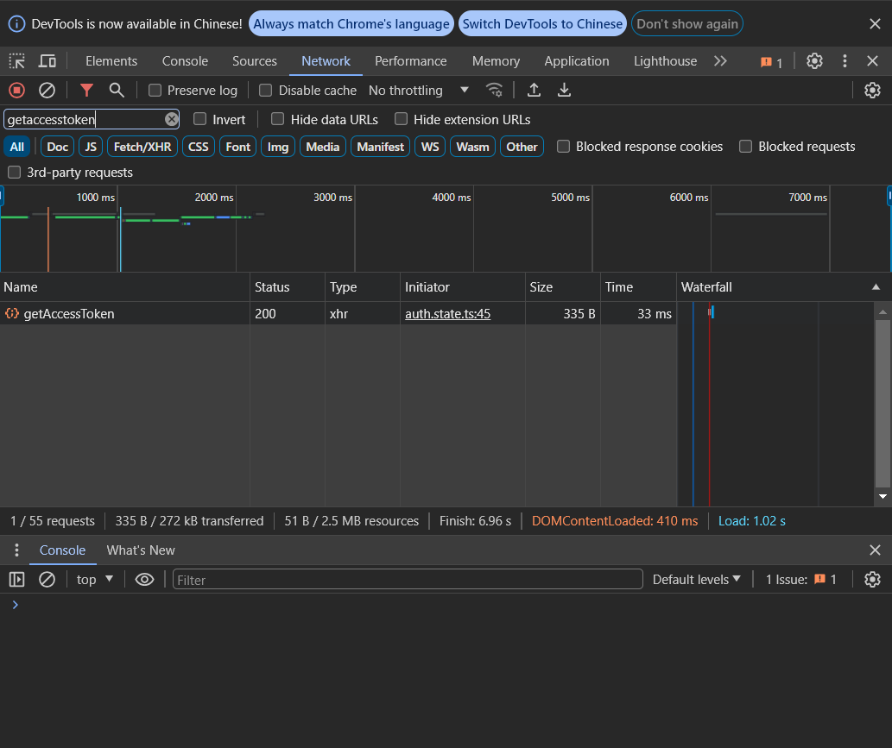
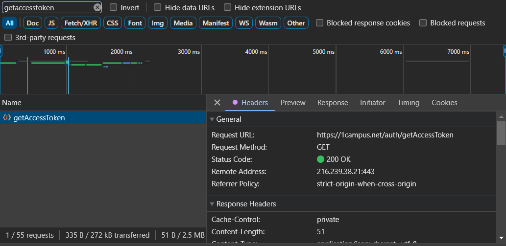
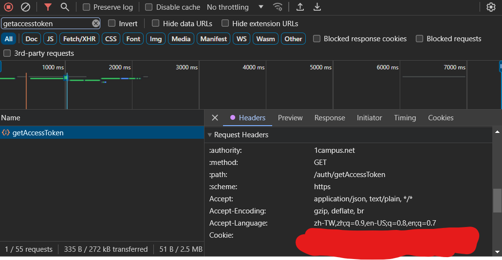
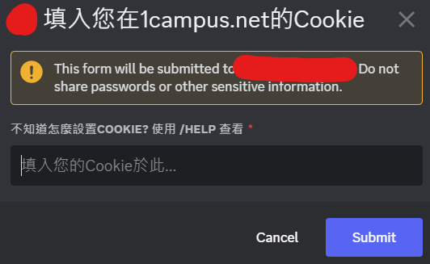
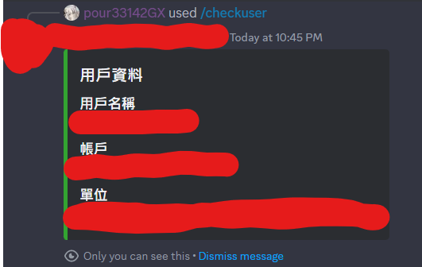

# 設置Cookie教學

首先開啟[網頁版1campus](https://1campus.net/)並登入

登入完成之後，按下``f12``開啟開發者工具

或是右鍵 -> 檢查

接著點選上方的``Network``

重新整理網頁，接著在``filter``搜尋``getaccesstoken``

點進下面的``getAccessToken``

往下滑，在``Request Headers``裡找到``Cookie``

把``Cookie``的值整個複製起來

接著回到discord，使用機器人指令``/setcookie``

複製貼上你的cookie就好

最後可以使用機器人指令`/checkuser`確認cookie是否有設置成功

# 原本都可以使用，有天突然不能查詢怎麼辦

重新設定一次Cookie就好